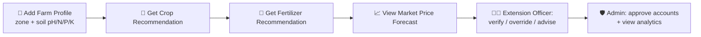

<div align="center">


<a href="http://agriadvisory.app">
  
</a>

<br/>

🔗 **Live:** [agriadvisory.app](http://agriadvisory.app)

<p>
  
  
  
  
  
  
</p>


</div>

<br/>

## ✨ Why This Project?

> For Bangladesh's small and medium farmers, three decisions drive income more than anything else: **which crop to plant, how much fertilizer to apply, and when to sell.** The **Smart Agri-Advisory Platform** turns all three into data-driven, automated decisions — connecting field-level farmers, agricultural extension officers, suppliers, and admins in one unified system.

<div align="center">

| 🌱 | 🧪 | 📈 | 🍃 |
|:---:|:---:|:---:|:---:|
| **Crop Recommendation** | **Fertilizer Recommendation** | **Market Forecasting** | **Disease Detection** |
| Random Forest · ~83% accuracy | Rule-based + k-NN | Sequence / LSTM model | CNN, trained on PlantVillage (42k images, 38 classes) |

</div>

---

## 🏗️ Architecture

```
┌──────────────────────────────┐         HTTP / Axios        ┌───────────────────────────────┐
│   🖥️  Laravel 11 + Blade      │ ───────────────────────────▶ │   🧠  Flask ML Microservice     │
│   RBAC · PostgreSQL · UI      │ ◀─────────────────────────── │   Random Forest · k-NN · CNN   │
│   laravel-backend/            │            JSON               │   ml-service/                   │
└──────────────────────────────┘                              └───────────────────────────────┘
```

| Layer | Tech | Responsibility |
|---|---|---|
| 🌐 **Web App** | Laravel 11, Blade, PostgreSQL (Supabase) | RBAC, farm profiles (soil pH/N/P/K), recommendation management, admin panel |
| 🤖 **ML Service** | Python, Flask, scikit-learn, TensorFlow/Keras | Crop/fertilizer prediction, price forecasting, disease detection API |
| ☁️ **Hosting** | Azure App Service (Malaysia West) | Both services deployed independently, custom domain + SSL |

---

## 🚀 Quick Start

### 1️⃣ Start the ML Service

```bash
cd ml-service
python3 -m venv venv && source venv/bin/activate
pip install -r requirements.txt

python generate_data.py         # 🔄 Generate synthetic dataset
python train_crop_model.py      # 🌾 Train Random Forest model
python price_forecast.py        # 📊 Train price forecasting model

python app.py                   # ➜ http://localhost:5000
```

### 2️⃣ Start the Laravel App

```bash
cd laravel-backend
composer install
cp .env.example .env
php artisan key:generate
php artisan migrate --seed

php artisan serve               # ➜ http://localhost:8000
```

> 📖 For seeded demo accounts and the full schema-to-code map, see `laravel-backend/README.md`

### 3️⃣ Feature Flow



---

## 📦 What's Inside (26-Table Normalized Schema)

<details>
<summary><b>🗂️ Click to view core modules</b></summary>

| Module | Description |
|---|---|
| `users` / RBAC | Farmer, Extension Officer, Supplier, Admin — four distinct roles |
| `climate_zones` / `crops` | Climate zone and crop master data |
| `farm_profiles` | Farmer's land data — soil pH, N, P, K stored directly |
| `recommendations` | Log of all crop, fertilizer, and price recommendations |
| Fertilizer / price / pest history | Historical data tracking |
| Extension Officer tools | Verification, override, advisory, alerts, training |
| Supplier module | Products, orders, inquiries |
| Admin panel | Master-data management, retrain trigger, backup, analytics |

</details>

---

## ✅ What Actually Works vs 🚧 What's Still Scaffolded

| Status | Component | Details |
|:---:|---|---|
| ✅ **Ready & tested** | Crop Random Forest model | ~83% accuracy on synthetic data |
| ✅ **Ready & tested** | Fertilizer recommendation engine | Rule-based + k-NN |
| ✅ **Ready & tested** | Price forecasting model | Sequence model, tested end-to-end via curl |
| ✅ **Ready & tested** | Pest/disease CNN | Trained on PlantVillage dataset (42k images, 38 classes), integrated into live ML service |
| ⚙️ **Local setup required** | Laravel backend | `composer install` — Packagist not reachable from sandbox |

---

## 🛠️ Recent Fixes & Improvements

- 🔧 Migrated database from MySQL to PostgreSQL (Supabase)
- 🐛 Fixed cascading production issues: nginx routing, Trusted Proxy config, Supabase seeding, config cache
- 📬 Built email integration via Brevo HTTP API
- 🧑‍🌾 Populated the platform with realistic sample farmer profiles and agri-marketplace product data
- 📄 Generated a 13-page backend code presentation deck

---

## 🎯 Next Steps

- [ ] Replace `ml-service/data/crop_data.csv` with real BARI data and re-run `train_crop_model.py`
- [ ] Add `OPENWEATHER_API_KEY` to `.env` and populate `weather_logs` with real, scheduled weather data
- [ ] Add `php artisan make:test` coverage across controllers for grading

---

<div align="center">


### 🌍 Live Deployment
**🔗 [agriadvisory.app](http://agriadvisory.app)**

Made with for Bangladeshi Farmers

</div>
